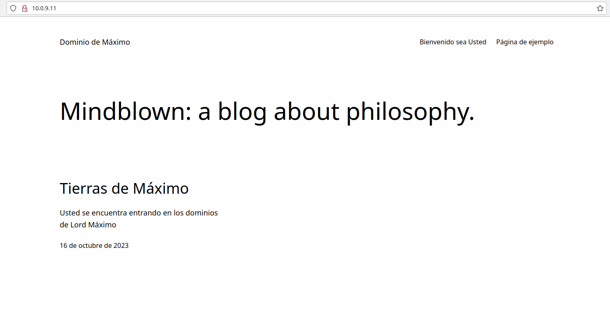

# Leanme Compose 

## Para Establecer el Compose Wordpress
Se debe crear un archivo con el nombre `docker-compose.yml`, para una instalacion rapida y simple se seguira la guia que tiene Docker sobre Wordpress asi como su guia para Compose, siendo la primera """""esto y la segunda [Apretame](https://github.com/docker/awesome-compose/tree/master/official-documentation-samples/wordpress/) donde explica como usar el wordpress` desde el propio servicio 
## Explicando el Compose Wordepress
Los modificadores `env` o `enviroment` son para indicar que es una *variable de entorno*, estas son variables de la propia imagen ya sea un  `BASEDATOS_USER`, para establecer el usuario de la base de datos, `BASEDATOS_PASSWORD`, para establecer la contraseña de usuario inicial, entre otras más, el modificador `images` es para el indicar que servicio usaremos así como su *versión*,  siendo la última indicada por la etiqueta o *TAG*, esta información se puede encontrar en su página de docker hub.

El modificador `volumes` es para indicar donde debe de *guardar y cargar* la información que se haga con el contenedor que se le indique, otro sería `ports` siendo estos para indicar que *puerto de la máquina nativa* debe de enlazarse con que *puerto del contenedor* que se le indique, en ese orden.

Otros modificadores son `expose` que son utilizados para permitir la *comunicación más fácil * entre los distintos *contenedores* que se encuentren en el compose,  `command` este siendo para ejecutar una linea de comando *
*en la terminal de la máquina virtual* del contenedor en el que se ponga.

Luego solo se tiene que levantar el propio compose, con el comando `docker compose up -d`

## Usar Wordpress
Para usar Wordpress, una vez instando y con el servicio levantado se tiene que ir a un navegador y desde su misma barra de navegación introducir la ip de la máquina seguido de `:` y el puerto de la maquina nativa con el que se estableció el servicio de wordpress.

Desde ahí solo se tiene que seguir la guía que se indicó antes sobre la página y configuración de la misma.

